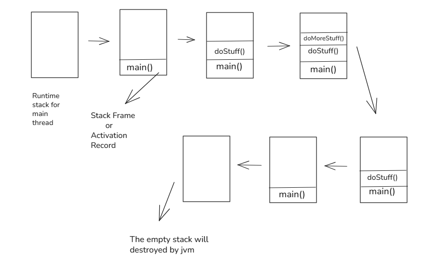

# Exception Handling in java

- [Introduction](#introduction)
- [Runtime stack mechanism](#runtime-stack-mechanism)
- [Default exception handling](#default-exception-handling)
- [Exception hierarchy](#exception-hierarchy)
- [Checked Exception vs UncheckedException](#checked-exception-vs-unchecked-exception)
- [Behavior of Some Exceptions](#behavior-of-some-exceptions)
- [Customized exception handling by using try catch](#customized-exception-handling-by-using-try-catch)
- [Method to print exception information](#method-to-print-exception-information)
- [try with multiple catch blocks](#try-multiple-catch-block)
- [final, finally, finalize](#final-finally-finalize)
- [Various possible combination of try catch finally](#various-combination-of-try-catch-finally)
- [throw keyword](#throw)
- [throws keyword](#throws)
- [Exception handling keywords summary](#quick-notes)
- [Various possible compile time errors in exception handling](#various-compile-time-error-in-exception-handling)
- [Customized or user defined exceptions](#cutomized-or-user-defined-exception)
- [Top-10 exceptions](#top-10-exceptions)
- [1.7 version enhancements](#17-version-enhancements-with-exception-handling)
    1. [try with resources](#try-with-resources)
    2. [multi-catch block](#multi-catch-block)

# Introduction

An **exception** in programming is an event that disrupts the normal flow of a program’s execution. It usually occurs when an error or unexpected situation arises during runtime, such as dividing a number by zero, trying to access an invalid array index, or opening a file that does not exist.

Instead of the program immediately crashing when such situations occur, many programming languages (like Java, C#, Python, etc.) provide a mechanism called **exception handling**. This allows developers to detect, handle, and recover from errors gracefully.

it is highly recommended to handle exception and the main objective of exception handling is graceful termination of the program.

Exception handling does not mean repairing an exception, we have to provide alternate way to continue rest of the program normally is the concept of exception handling.

example - Our programming requirement is to read data from remote file locating at London, at runtime if London file is not available our program should not be terminated abnormally, we have to provide some local file to continue rest of the program normally.

# Runtime Stack mechanism

For every thread JVM will create runtime stack, each and every method call performed by thread will be stored in the corresponding stack.

Each Entry in the stack is called Stack Frame or Activation Record. After completing every method call the corresponding entry will be removed.

After completing all method calls, stack will become empty and the empty stack will be destroyed by JVM just before terminating the thread.

Example:

```java
Class Test {
    public static void main(String[] args) {
        doStuff();
    }
    
    public static void doStuff() {
        doMoreStuff();
    }
    
    public static void doMoreStuff() {
        System.out.println("Hello");
    }
}
```



# Default Exception Handling

- Inside a method if any exception occurs the method in which it rise JVM is responsible to create exception object by including the following information
    1. Name of exception
    2. Description of exception
    3. Location at which exception occurs (Stack Trace)
- After creating exception object method hand overs the object to the JVM.
- JVM will check whether the method contains any exception handling code or not, if the method does not contain exception handling code then JVM terminates that method abnormally and removes the corresponding entry from the stack.
- Then identifies collar method and checks whether collar method contains any handling code or not.
- if the collar method does not contain handling code then JVM terminates the collar method also abnormally and removes corresponding entry from the stack.
- This process will be continued until main method and if the main method also does not contain handling code then JVM terminates main method also abnormally and removes corresponding entry from the stack.
- Then JVM hand overs responsibility of exception handling to “Default Exception Handler”, which is the part of JVM.
- Default Exception Handler prints exception information in the following format and the terminates program abnormally.
    
    ```
     Exception in thread "xxx" Name of Exception:Description Stack Trace
    ```
    

**Example 1:**

```java
Class Test {
    public static void main(String[] args) {
        doStuff();
    }
    
    public static void doStuff() {
        doMoreStuff();
    }
    
    public static void doMoreStuff() {
        System.out.println(10 / 0);
    }
}
```

output:

```
Exception in thread "main" java.lang.ArithimeticException: / by zero
          at Test.doMoreStuff(Test.java:11)
          at Test.doStuff(Test.java:7)
          at Test.main(Test.java:3)
```

**Example 2:**

```java
Class Test {
    public static void main(String[] args) {
        doStuff();
    }
    
    public static void doStuff() {
        doMoreStuff();
        System.out.println(10 / 0);
    }
    
    public static void doMoreStuff() {
        System.out.println("Hello");
    }
}
```

output:

```
Hello
Exception in thread "main" java.lang.ArithimeticException: / by zero
          at Test.doStuff(Test.java:12)
          at Test.main(Test.java:3)
```

**Example 3:**

```java
Class Test {
    public static void main(String[] args) {
        doStuff();
        System.out.println(10 / 0);
    }
    
    public static void doStuff() {
        doMoreStuff();
        System.out.println("Hii");
    }
    
    public static void doMoreStuff() {
        System.out.println("Hello");
    }
}
```

output:

```java
Hello
Hii
Exception in thread "main" java.lang.ArithimeticException: / by zero
          at Test.main(Test.java:4)
```

> Note:
> 
> - In a program, if at least one method terminates abnormally the program termination is abnormal termination.
> - If all methods terminated abnormally then only program termination is normal termination.

# Exception Hierarchy

- Throwable class access root for java exception hierarchy.
- Throwable class defines two child classes
    1. Exception
    2. Error

## Exception

Most of the time exceptions are caused by our program and these are recoverable.

For example, if our programming requirement is to read data from remote file locating at London at runtime, if remote file is not available then will get “RuntimeException” saying “FileNotFoundException”.

if FileNotFoundException occurs we can provide local file and continue rest of the program normally.

```java
try {
    // Read data from remote file locating at London.
} 
catch (FileNotFoundException e) {
    // Use local file and continue rest of the program normally.
}
```

## Error

Most of the time errors are not caused by our program and these are due to lack of system resources. Errors are non-recoverable.

For example, “OutOfMemoryError” occurs being a programmer we can’t do anything and the program will be terminated abnormally.

System admin and Server admin increase heap memory.


# Checked Exception vs Unchecked Exception

## Checked Exception

- The Exceptions are checked by compiler for smooth execution of the program are called Checked Exception. Example : FileNotFoundException, IOException etc.
- In our program, if there is chance of rising checked exception then compulsory we should handle the checked exception (either by try-catch or throws keyword) otherwise we will get compile time error.

**Example:**

```java
import java.io.*;

public class Test {
    public static void main(String[] args) {
        PrintWriter pw = new PrintWriter("abc.txt");
        pw.println("Hello");
    }
}
```

output:

```
unreported exception java.io.FileNotFoundException;
    must be caught or declared to be thrown
```

## Unchecked Exception

- The Exception which are not checked by compiler whether programmer handling or not, such types of exception are called Unchecked Exception. Example: ArithmeticException, NullPointerException etc.

> Note:
> 
> - Whether it is checked or unchecked every exception occurs at runtime only, there is no chance of occuring any exception at compile time.
> - Runtime and its child classes, errors and its child classes are unchecked except this remaining are checked.

## Fully Checked vs Partially Checked

- A checked exception is said to be Fully checked, if and only if all its child classes also checked. Example - IOException, InterruptedException etc.
- A checked exception is said to be Partially Checked, if and only if some it’s child classes are unchecked. The only possible partially checked exception in java are Exception, Throwable.

# Behavior of some Exceptions

- IOException —> Checked(Fully)
- RuntimeException —> Unchecked
- InterruptedException —> Checked(Fully)
- Error —> Unchecked
- Throwable —> Checked(Partially)
- ArithmeticException —> Unchecked
- NullPointerException —> Unchecked
- Exception —> Checked(Partially)
- FileNotFoundException —> Checked(Fully)

# Customized Exception Handling by using try-catch

- It is highly recommended to handle exceptions.
- The code which may rise exception is called Risky code and we have to define that code inside try block and corresponding handling code have to define inside catch block.

```java
try {
    // Risky code
}
catch (Exception e) {
    // Handling code
} 
```

**Example**

without try-catch (abnormal termination)

```java
Class Test {
    public static void main(String[] args) {
        System.out.println("Statement 1");
        System.out.println(10 / 0);
        System.out.println("Statement 3");
    }
}
```

output

```
Statement 1
Exception in thread "main" java.lang.ArithimeticException: / by zero
          at Test.main(Test.java:4)
```

With try-catch (normal termination)

```java
Class Test {
    public static void main(String[] args) {
        System.out.println("Statement 1");
        try {
            System.out.println(10 / 0);
        }
        catch (Exception e) {
            System.out.println(10 / 2);
        }
        System.out.println("Statement 3");
    }
}
```

output:

```
Statement 1
5
Statement 3
```

### Case Study

```java
try {
    // statement 1
    // statement 2
    // statement 3
}
catch (Exception e) {
    // statement 4
}
// statement 5
```

Case 1:

if there is no exception occurs then flow of execution is 1,2,3,5 (Normal termination).

Case 2:

if there is any exception occur in statement 2 and corresponding catch block matched then flow of execution is 1,4,5 (Normal termination).

Case 3:

if there is any exception occur in statement 2 and corresponding catch block doesn’t match then flow of execution is 1, (Abnormal termination).

Case 4:

if there is any exception occur in statement 4  and 5 then it is always Abnormal termination.

> Note:
> 
> - Within try block if anywhere exception rise then rest of the try block won’t be executed even though we handled that exception hence within the try block we have to take only risky code and length of try block should be as less possible.
> - In addition to try block there may be chance of rising exception inside catch and finally blocks.
> - If any statement which is not part of try block and rise an exception then it is always abnormal termination.

## Method to print exception information

The Throwable class defines following methods to print exception information:

| Method | Printable format |
| --- | --- |
| 1. printStackTrace() | Name of Exception : Description
|                 |  Stack Trace |
| 2. toString() | Name of Exception : Description |
| 3. getMessage() | Description |

Example:

```java
class Test {
    public static void main(String[] args) {
        try {
            System.out.println(10 / 0);
        }
        catch (ArithmeticException  e) {
            // Method 1
            e.printStackTrace();
            // Method 2
            System.out.println(e);
            // Method 3
            System.out.println(e.getMessage());
        }
    }
}
```

output:

```
// Method 1 output
java.lang.ArithimeticException: / by zero
          at Test.main(Test.java:4)
          
// Method 2 output
java.lang.ArithimeticException: / by zero

// Method 3 output
/ by zero
```

> Note:
> 
> - Internally Default Exception Handler use printStackTrace() method to print exception information to the console.

# Try multiple catch block

- The way of handling an exception is varied from exception to exception hence for every exception it is highly recommended to take separate catch block i.e try with multiple catch block is always possible and recommended to use.
    
    ```java
    try {
        // Risky code
    }
    catch (ArithmeticException e) {
        // perform arithmetic operations
    }
    catch (SQLException e) {
        // use mySQL db instead oracle db
    } 
    catch (FileNotFoundException e) {
        // use local file instead remote file
    }
    catch (Exception e) {
        // default exception handling
    }
    ```
    
- If try with multiple catch block is present then order of catch block is very important, we have to take child first then parent otherwise we will get compile error saying “Exception abc has already has been caught”
    
    Example: (Invalid)
    
    ```java
    try {
        // Risky code
    }
    catch (Exception e) {
        // default exception handling
    }
    catch (ArithmeticException e) {
        // perform arithmetic operations
    }
    ```
    
    ```
    exception java.lang.ArithmeticException has already been caught
    ```
    
    output:
    
    Valid
    
    ```java
    try {
        // Risky code
    }
    catch (ArithmeticException e) {
        // perform arithmetic operations
    }
    catch (Exception e) {
        // default exception handling
    }
    ```
    
- We can’t declare two catch block for the same exception otherwise we will get compile time error.
    
    ```java
    try {
        // Risky code
    }
    catch (ArithmeticException e) {
        // perform arithmetic operations
    }
    catch (ArithmeticException e) {
        // perform arithmetic operations
    }
    ```
    
    output
    
    ```
    exception java.lang.ArithmeticException has already been caught
    ```
    

# final, finally, finalize()

## final

- final is a modifier applicable for classes, methods, and variables.
- If a class declared as a final then we can’t extends that class i.e we can’t create child class for that class, means inheritance is not possible for final classes.
- if a method is final then we can’t override that method in child class.
- if a variable declared as a final we can’t perform reassignment for that variable.

## finally

- finally is a block always associated with try-catch to maintain cleanup code.
    
    ```java
    try {
        // Risky code
    }
    catch (Exception e) {
        // Handling code
    }
    finally {
        // Cleanup code
    }
    ```
    
- The speciality of finally block is it will be executed always irrespective of exception is rised or not rised and whether handled or not handled.

## finalize()

- finalize() is a method always invoked by garbage collector just before destroying an object to perform cleanup activities, once finalize() method completes immediately garbage collector destroyed that object.

> Note:
> 
> - finally block is responsible for cleanup activities related to try block i.e whatever resources is open at try block will be closed inside finally block whereas finalize() is responsible to cleanup activities related to Object whatever resources associated with object will be deallocated  by using finalize() method.

# Various Combination of try-catch-finally

- In try-catch-finally order is important.
- Whenever we are writing try compulsory we should write catch or finally otherwise we will get compile time error i.e try without catch or finally invalid.
- whenever we are writing catch block compulsory try block is required. i.e catch without try is invalid.
- Whenever we are writing finally block compulsory we should write try block. i.e finally without try is invalid.
- Inside try-catch-finally block we can declare try-catch-finally blocks. i.e nesting of try-catch-finally is allowed.
- For try-catch-finally blocks curly braces are mandatory.

```java
// Valid
try {

}
catch (X e) {

}
```

```java
// Invalid
try {

}
catch (X e) {

}
catch (X e) {

}

// output
Exception
has already
been caught
```

```java
// Valid
try {

}
finally {

}
```

```java
// Valid
try {

}
catch (X e) {

}
try {

}
finally {

}
```

```java
// Invalid
catch (X e) {

}

// output
catch without
try
```

```java
// Invalid
try {

}
finally {

}
catch(X e) {

}

// output
catch without
try
```

```java
// Invalid
try {

}
catch (X e) {

}
System.out.println("Hello");
catch (Y e) {

}

// output
catch without
try
```

```java
// valid
try {
    try {
    
    }
    catch (X e) {
    
    }
}
catch (X e) {

} 
```

```java
// Valid 
try {
    try {
    
    }
    finally {
    
    }
}
catch (X e) {

}
```

```java
// Invalid
try {

}
catch (X e) {
    finally {
    
    }
}

// output
finally without try
```

```java
// Invalid
try {

}
catch (X e) {

}
finally {
    finally {
    
    }
}

// output
finally without try
```

```java
// Invalid
try 
  System.out.println("try");
catch (X e) {

}
finally {

}
```

```java
// Invalid
try { 

}  
catch (X e) {

}  
finally 
  System.out.println("try");
```

```java
// Valid
try {

}
catch (X e) {

}
catch (Y e) {

}
```

```java
// Valid
try {

}
catch (X e) {

}
finally {

}
```

```java
// Valid
try {

}
catch (X e) {

}
try {

}
catch (X e) {

}
```

```java
// Invalid
try {

}

// output
try without
catch (or)
finally
```

```java
// Invalid
finally {

}

// output
finally without
try
```

```java
// Invalid
try {

}
System.out.println("Hello");
catch (X e) {

}

// output
1. try without catch
2. catch without try
```

```java
// Invalid
try {

}
catch (X e) {

}
try {

}
System.out.println("Hello");
finally {

}

// output
finally without try
```

```java
// Invalid
try {
    try {
    
    }
}
catch (X e) {

}

// output
try without catch or finally
```

```java
// Valid
try {

}
catch (X e) {
    try {
    
    }
    finally {
    
    }
}
```

```java
// Valid
try {

}
catch (X e) {

}
finally {
    try {
    
    }
    catch (X e) {
    
    }
}
```

```java
// Invalid
try {

}
catch (X e) {

}
finally {
    
}
finally {
    
}

// output
finally without try
```

```java
// Invalid
try { 

}  
catch (X e)
  System.out.println("try");
finally {

}
```

# throw and throws keyword

## throw

- sometimes we can create exception explicitly, we can handover to the JVM manually, for this we have to use **throw** keyword.
    
    ```java
    throw new ArithmeticException("/ by zero");
    ```
    
- hence, the main objective of throw keyword is to handover our created exception to the JVM manually.

Example:
Automatic Exception:

- In this case, main method is responsible for creating exception object and handover to the JVM.
    
    ```java
    class Test {
        public static void main(String[] args) {
            System.out.println(10 / 0);
        }
    }
    
    // output
    Exception in thread "main" java.lang.ArithmeticException:/ by zero
               at Test.main(Test.java:3)
    ```
    

Using throw keyword:

- In this case, programmer creating exception object explicitly and handover to the JVM manually.
    
    ```java
    class Test {
        public static void main(String[] args) {
            throw new ArithmeticException("/ by zero");
        }
    }
    
    // output
    Exception in thread "main" java.lang.ArithmeticException:/ by zero
               at Test.main(Test.java:3)
    ```
    

Hence, ouput of above two program is exactly same.

> Note:
> 
> - Best use of throw keyword is for user defined exception and customized exception.

### case study of throw keyword

1. throw e: if ‘e’ refers null then we will get NullPointerException.
    
    Example:
    
    ```java
    class Test {
        static ArithmeticException e = new ArithmeticException();
        public static void main(String[] args) {
            throw e;
        }
    }
    
    // output 
    RE:Exception in thread "main" java.lang.ArithmeticException: / by zero
               at Test.main(Test.java:4)
    ```
    
    ```java
    class Test {
        static ArithmeticException e;
        public static void main(String[] args) {
            throw e;
        }
    }
    
    // output
    RE:Exception in thread "main" java.lang.NullPointerException:
    ```
    
2. After throw statement we are not allowed to write any statement directly otherwise we will get compile time error saying “unreachable statement”.
    
    Example:
    
    ```java
    class Test {
        public static void main(String[] args) {
            System.out.println(10 / 0);
            System.out.println("Hello");
        }
    }
    
    // output
    RE:Exception in thread "main" java.lang.ArithmeticException:/ by zero
    ```
    
    ```java
    class Test {
        public static void main(String[] args) {
            throw new ArithmeticException("/ by zero");
            System.out.println("Hello");
        }
    }
    
    // output
    CE: unreachable statement
    ```
    
3. we can use throw keyword only throwable types if we are trying to use for normal java objects, we will get compile time error saying “incompatible types”.
    
    Example
    
    ```java
    class Test {
        public static void main(String[] args) {
            throw new Test();
        }
    }
    
    // output
    CE:incompatible types
       found:Test
       required:java.lang.Throwable
    ```
    
    ```java
    class Test extends RuntimeException {
        public static void main(String[] args) {
            throw new Test();
        }
    }
    
    // output
    RE:Exception in thread "main" Test
          at Test.main(Test.java:3)
    ```
    

## throws

- In our program if there is any possibility of rising checked exception, then compulsory we should handle checked exception otherwise we will get compile time error saying “unreported exception XXX; must be caught or declared to be thrown”.
    
    Example 1:
    
    ```java
    import java.io.*;
    
    class Test {
        public static void main(String[] args) {
            PrintWriter pw = new PrintWriter();
            pw.println("Hello");
        }
    }
    
    // output
    CE: unreported exception java.io.FileNotFoundException;
        must be caught or declared to be thrown
    ```
    
    Example 2:
    
    ```java
    class Test {
        public static void main(String[] args) {
            Thread.sleep(10000);
        }
    }
    
    // output
    CE: unreported exception java.lang.InterruptedException;
        must be caught or declared to be thrown
    ```
    

we can handle this compile time error by using following two ways:

1. **By using try-catch**
    
    ```java
    class Test {
        public static void main(String[] args) {
            try {
                Thread.sleep(10000);
            }
            catch (InterruptedException e) {}
        }
    }
    ```
    
2. By using throws keyword
    - Purpose of throws keyword: To delegate the responsibility of exception handling to the caller method. (caller method may be JVM or another method).
    
    ```java
    class Test {
        public static void main(String[] args) throws InterruptedException {
            Thread.sleep(10000);
        }
    }
    ```
    

> Note:
> 
> - throws keyword required only for checked exceptions and uses of throws keyword for unchecked exception, there is no use or no impact.
> - throws keyword required only to convinece compiler and used of throws keyword doesn’t prevent abnormal termination of the program.

Another Example of throws keyword:

```java
class Test {
    public static void main(String[] args) throws InterruptedException {
        doStuff();
    }
    
    static void doStuff() throws InterruptedException {
        doMoreStuff();
    }
    
    static void doMoreStuff() throws InterruptedException {
        Thread.sleep(10000);
    }
}
```

In above program, if we remove atleast one throws statement then the code won’t compile.

> Note :
> 
> - It is recommended use try-catch over throws keyword.

### case study of throws keyword

1. we can use throws keyword for methods and constructor, but not for classes.
    
    Example:
    
    ```java
    class Test throws Exception { // wrong
    
        Test() throws Exception { // correct
        
        }
        
        public void m1() throws Exception { // correct
        
        }
    }
    ```
    
2. we can use throws keyword only for throwable types, if we are trying to use for normal java classes then we will get compile time error saying “incompatible types”.
    
    **Example:**
    
    correct:
    
    ```java
    class Test extends RuntimeException {
        public void m1() throws Test {
        
        }
    }
    ```
    
    wrong:
    
    ```java
    class Test {
        public void m1() throws Test {
        
        }
    }
    ```
    
3. case 3
    
    ```java
    class Test {
        public static void main(String[] args) {
            throw new Exception();
        }
    }
    
    // output
    RE:Unreported exception in java.util.Exception
       must be caught or declared to be thrown
    ```
    
    ```java
    class Test {
        public static void main(String[] args) {
            throw new Error();
        }
    }
    
    // output
    RE:Exception in thread "main" java.util.Error
       at Test.main(Test.java:3)
    ```
    
4. In our program, Within a try block if there is no chance of rising exception then we can’t write catch block for that exception otherwise we will get compile time error saying “Exception XXX is never thrown in body of corresponding try statement”. But this rule is applicable only for **fully checked exception**.
    
    ```java
    class Test {
        public static void main(String[] args) {
            try {
                System.out.println("Hello");
            }
            catch (ArithmeticException e) {  // Unchecked
            
            }
        }
    }
    
    // output
    Hello
    ```
    
    ```java
    class Test {
        public static void main(String[] args) {
            try {
                System.out.println("Hello");
            }
            catch (Exception e) {  // Patially checked
            
            }
        }
    }
    
    // output
    Hello
    ```
    
    ```java
    import java.io.*;
    class Test {
        public static void main(String[] args) {
            try {
                System.out.println("Hello");
            }
            catch (IOException e) {  // Fully checked
            
            }
        }
    }
    
    // output
    CE: Exception java.io.IOException
        is never thrown in body of 
        corresponding try statement.
    ```
    
    ```java
    class Test {
        public static void main(String[] args) {
            try {
                System.out.println("Hello");
            }
            catch (InterruptedException e) {  // Fully checked
            
            }
        }
    }
    
    // output
    CE: Exception java.io.InterruptedException
        is never thrown in body of 
        corresponding try statement.
    ```
    
    ```java
    class Test {
        public static void main(String[] args) {
            try {
                System.out.println("Hello");
            }
            catch (Error e) {  // Unchecked
            
            }
        }
    }
    
    // output
    Hello
    ```
    

# Quick Notes:

- try: To maintain risky codes
- catch: To maintain exception handling code
- finally: To maintain cleanup code
- throw: To hand-over our created exception object to the JVM manually.
- throws: To delegate the responsibility of creation handling to the caller.

# Various compile time error in exception handling

1. unreported exception XXX; must be caught or declared to be thrown
2. Exception XXX has already been caught
3. Exception XXX is never thrown in body of corresponding try statement
4. Unreachable statement
5. incompatible types
    
    found: Test
    
    required: java.lang.Throwable
    
6. try without catch or finally
7. catch without try
8. finally without try

# Cutomized or user defined exception

- Sometimes to meet the programming requirements we can define our own exceptions, such types of exceptions are called customized or user defined exception. Example: TooYoungException, TooOldException, InsufficientBalanceException.

Example:

```java
class TooYoungException extends RuntimeException {
    TooYoungException(String s) {
        super(s);
    }
}

class TooOldException extends RuntimeException {
    TooOldException(String s) {
        super(s);
    }
}

public class CustomException {
    public static void main(String[] args) {
        int age = Integer.parseInt(args[0]);
        
        if (age > 60) {
            throw new TooOldException("Your age is already crossed"
            + "marriage age..no chance of getting marriage.");
        }
        else if (age < 18) {
            throw new TooYoungException("plz wait some more time.."
            + "you will get best match soon");
        } else {
            System.out.println("You will get match details soon by eamil..!")
        }
    }
}
```

- throw keyword is best suitable for user defined or cutomized exception but not for pre-defined exception.
- it is highly recommended to define customized exception as unchecked. i.e we have to extend RuntimeException not Exception class.
- usage of super(s); : To make description available to Default exception handler.

# Top 10 Exceptions

- Based on the person who is rising that exception all exceptions are divided into two categories.
    1. JVM Exceptions
        - The exceptions which are rised automatically by JVM whenever particular events are called JVM Exceptions. Example: ArithmeticException, NullPointerException etc.
    2. Programmatic Exceptions
        - The exceptions which are rised explicitly either by programmer or API developer to indicate that something goes wrong are called Programmatic Exceptions. Example: TooOldException, IllegalArgumentException etc.

## ArrayIndexOutOfBoundException

- It is a child class of RuntimeException and hence it is unchecked, rised automatically by JVM whenever we are trying to access without of range index.
    
    ```java
    int[] arr = new int[4];
    System.out.println(arr[0]); // correct
    System.out.println(arr[10]); // RE: ArrayIndexOutOfBoundException
    System.out.println(arr[-10]); // RE: ArrayIndexOutOfBoundException
    ```
    

## NullPointerException

- It is a child class of RuntimeException and hence it is unchecked.
- Rised automatically by JVM whenever we are tyring to perform some operation on null;
    
    ```java
    String s = null;
    System.out.println(s.length());
    ```
    

## ClassCastException

- It is a child class of RuntimeException and hence it is unchecked.
- Rised automatically by JVM whenever we are trying to type cast from parent object to child type.

```java
// valid
String s = new String("durga");
Object o = (Object) s;
```

```java
// valid
Object o = new String("durga");
String s = (String) o;
```

```java
// Invalid
Object o = new Object();
String s = (String) o;

// RE: ClassCastException
```

## StackOverFlowError

- It is a child class of Error and hence it is unchecked.
- Rised automatically by JVM whenever we are trying to perform recursive method call.

```java
class Test {
    public static void main(String[] args) {
        m1();
    }
    
    private static void m1() {
        m2();
    }
    
    private static void m2() {
        m1();
    }
}

// output
RE: StackOverFlowError
```

## NoClassDefFoundError

- It is a child class of Error and hence it is unchecked.
- Rised automatically by JVM whenever JVM unable to find required .class file.
- if the test.class is not available then we will get RuntimeException saying NoClassDefFoundError.

## ExceptionInInitializerError

- It is a child class of Error and hence it is unchecked.
- Rised automatically by JVM if any exception occurs while excuting static variables assignments and static blocks.

```java
class Test {
    static int x = 10 / 0;
}

// output
RE: ExceptionInInitializerError
caused by
java.lang.ArithmeticException:
/ by zero.
```

```java
class Test {
    static {
       String s = null;
       System.out.println(s.length());
    }
}

// output
RE: ExceptionInInitializerError
caused by
java.lang.NullPointerException:
/ by zero.
```

## IllegalArgumentException

- It is a child class of RuntimeException and hence it is unchecked.
- Rised explicitly either by programmer or by API developer to indicate that a method has been invoked with illegal argument.
    
    **Example:** The value at a range of thread priority is 1 to 10, if  we are trying to set a priority with any other value then we will get Runtime Exception saying IllegalArgumentException.
    
    ```java
    Thead t = new Thread();
    t.setPriority(7);  // Correct
    t.setPriority(15); // throw RuntimeException
    ```
    

## NumberFormatException

- It is direct child class of IllegalArgumentException which is the child class of RuntimeException and hence it is unchecked.
- Rised explicitly either by programmer or API developer to indicate that we are trying to convert String to number and String is not properly formatted.
    
    Example:
    
    ```java
    int i = Integer.parseInt("10"); // correct
    int i = Integer.parseInt("ten"); // throw NumberFormatException
    ```
    

## IllegalStateException

- It is a child class of Runtime Exception and hence it is unchecked.
- Rised explicitly either by programmer or api developer to indicate that a method has been invoked at wrong time.
    
    Example: After starting a thread we are not allowed to restart same thread again otherwise we will get Runtime exception saying IllegalThreadStateException.
    
    ```java
    Thread t = new Thread();
    t.start();
    t.start(); // throw IllegalThreadStateException
    ```
    

## AssertionError

- It is a child class of Error and hence it is unchecked.
- Rised explicitly either by programmer  or by API developer to indicate that assert statement fails.
    
    Example: if x is not greater than 10 then we will get runtime exception saying AssertionError.
    
    ```java
    assert(x > 10)
    ```
    
    **Note:**
    
    | **Exception/Error** |
    | --- |
    | 1. ArrayIndexOutOfBoundException |
    | 2. NullPointerException |
    | 3. ClassCastException |
    | 4. StackOverFlowError |
    | 5. NoClassDefFoundError |
    | 6. ExceptionIntInitializerError |
    | 7. IllegalArgumentException |
    | 8. NumberFormatException |
    | 9. IllegalStateException |
    | 10. AssertionError |
    
    | Raised By |
    | --- |
    | 1 to 7 Raised Automatically by JVM and hence those are JVM exceptions |
    | 7 to 10 Raised explicitly either by programmer or by API developer and hence these are programmatic exception. |
    

# 1.7 version enhancements with exception handling

As a part of 1.7 version in exception handling the following two concept is used:

- try with resources
- multi-catch block

## try with resources

- Until 1.6 version, it is highly recommended to write finally block to close resources which are open at try block.
    
    Example:
    
    ```java
    BufferReader br = null;
    try {
        br = new BufferReader(new FileReader("input.txt"));
        // use br based on our requirement
    }
    catch (IOException e) {
        // Handling code
    }
    finally {
        if (br != null) {
            br.close();
        }
    }
    ```
    
    The Problems in this approach are: -
    
    - Compulsory programmer is required to close inside finally block. it increases complexity of programming.
    - We have to write finally block compulsory and hence it increases the length of the code and decreases readabillity.

To Overcome, some people introduced try with resources in 1.7 version, the main advantanges of try with resources is whatever resources we open will be closed automatically once control reaches end of try block either normally or abnormally and hence we are not required to close explicitly. So that complexity of programming will be reduced. we are not required to write finally block so that length of the code will be reduced and readability will be improved.

```java

try (BufferReader br = new BufferReader(new FileReader("input.txt"))) {
    // use br based on our requirement
    br will be closed automatically once control reader
    end of the block either normally or abnormally and we
    are not responsible to close explicitly.
}
catch (IOException e) {
    // Handling code
}
```

### Conclusion

- We can declare multiple resources but these resources should be separated with semi colon( ; ).
    
    ```java
    try (R1;R2;R3...) {
        // code
    }
    ```
    
- All resources should be Auto-closable reosurces.
    
    A resource is said to Auto-closable if and only if corresponding class implements [java.la](http://java.la)ng.AutoClosable interface.
    
    All IO related resources, database related resources, and network related resources are already implemented AutoClosable interface. Being a programmer we are not required to do anything just we should aware the concept.
    
- AutoClosable came in 1.7 version and it contains only one method “close()”.
- All resource reference variables are implicitly final and hence within try block we can’t perform reassignment otherwise we will get compile time error.
    
    ```java
    
    try (BufferReader br = new BufferReader(new FileReader("input.txt"))) {
        br = new BufferReader(new FileReader("output.txt"));
    }
    
    // output
    Compile time error: Auto-Closable resources br may not be assigned.
    ```
    
- Until 1.6 v, try should be associated with either catch or finally block but 1.7v onwards we can take only try with resource without catch or finally.
    
    ```java
    try (R) {
    
    }
    ```
    
- The main advantage of try with resources is we are not required to write finally block explicitly because we are not required to close explicitly. Hence until 1.6v finally block is just like hero but 1.7v onwards it is dummy and becomes zero.

## Multi-catch block

- Until 1.6v, Even though multiple different exception having same handling code, for every exception type we have to write a separate catch block, it increases the length of the code and reduces readability.
    
    ```java
    try {
       
    }
    catch (ArithmeticException e) {
        e.printStackTrace();
    }
    catch (IOException e) {
        e.printStackTrace();
    }
    catch (NullPointerException e) {
        System.out.println(e.getMessage());
    }
    catch (InterruptedException e) {
        System.out.println(e.getMessage());
    }
    ```
    
- To overcome this problem, some people introduced multi-catch block in 1.7v.
- According to this we can write single catch block that can handle multiple different types of exception.
    
    ```java
    try {
       
    }
    catch (ArithmeticException | IOException e) {
        e.printStackTrace();
    }
    catch (NullPointerException | InterruptedException e) {
        System.out.println(e.getMessage());
    }
    ```
    
- The main advantages of this approach is the length of the code will be reduced and readability will be improved.

Example:

```java
try {
    System.out.println(10/0);
    String s = null;
    System.out.println(s.length());
}
catch (ArithmeticException | IOException e) {
    e.printStackTrace();
}
```

### Conclusion

- In above example, whether rised expception is ArithemeticException or NullPointerException the same catch block is listen.
- In multi-catch block there should not be relation between exception type either child to parent or parent to child or same type otherwise we will get compile time error.
    
    Example:
    
    ```java
    try {
       
    }
    catch (ArithmeticException | Exception e) {
        e.printStackTrace();
    }
    
    // output
    Compile time error: Alternatives in multi-catch statement cannot
    be related by sub-classing.
    ```
    

# Exception Propogation

- Inside a method if a exception is rised and if we are not handling that exception then exception object will be propagated to caller method. Then caller method is responsilble to handle that exception. This process is called Exception Propogation.

# Rethrowing Exception

- We can use this approach to convert one exception type to another exception type.
    
    Example:
    
    ```java
    try {
    
    }
    catch (ArithmeticException e) {
        throw new NullPointerExxception();
    }
    ```