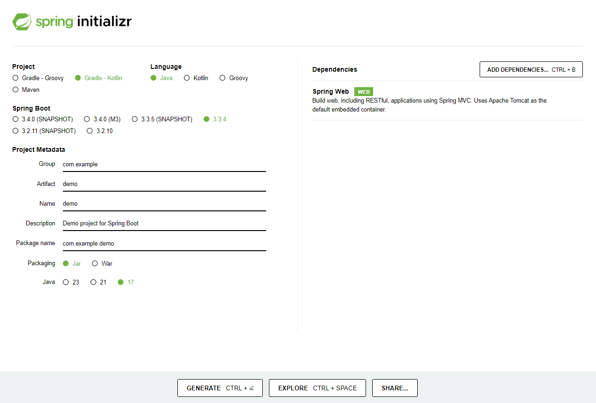

# Spring Boot (SpringApplication)

- [Features](#features)
- [Creating First Spring Boot Project](#create-first-spring-boot-project-with-spring-initializr)
- [@RestController and @RequestMapping Annotations](#the-restcontroller-and-requestmapping-annotations)
- [Creating an Executable Jar](#creating-an-executable-jar)
- [Developing with Spring Boot](#developing-with-spring-boot)
- [Structuring your code](#structuring-your-code)
    1. [Using the “default” package](#using-the-default-package)
    2. [Locating the Main Application class](#locating-the-main-application-class)
    3. [Configuration classes](#configuration-classes)
    4. [Importing XML configuration](#importing-xml-configuration)
    5. [Auto Configuration](#auto-configuration)
- [Spring Beans & Dependency Injection](#spring-beans-and-dependency-injection)
- [SpringApplication](#springapplication)
    1. [Startup Failure](#startup-failure)
    2. [Lazy Initialization](#lazy-initialization)
    3. [Banner](#banner)
    4. [Customizing SpringApplication](#customizing-springapplication)
- [Application Availability](#application-availability)
- [Application Events and Listeners](#application-events-and-listensers)
- [Web Environment](#web-environment)
- [Accessing Application Arguments](#accessing-application-arguments)
- [Application Exit](#application-exit)

Spring Boot is a framework for building applications in java & kotlin programming language.

Spring Boot makes it easy to create stand-alone, production-grade Spring based Applications that you can "just run".

# Features

- Create stand-alone Spring applications
- Embed Tomcat, Jetty or Undertow directly (no need to deploy WAR files)
- Provide opinionated 'starter' dependencies to simplify your build configuration
- Automatically configure Spring and 3rd party libraries whenever possible
- Provide production-ready features such as metrics, health checks, and externalized configuration
- Absolutely no code generation and no requirement for XML configuration.

# Create First Spring Boot Project with [spring initializr](https://start.spring.io/)

### **Step 1: Start a new Spring Boot project**

Use [start.spring.io](http://start.spring.io/) to create a “web” project. In the “Dependencies” dialog search for and add the “web” dependency as shown in the screenshot. Hit the “Generate” button, download the zip, and unpack it into a folder on your computer.



Here, i am using project:  Gradle - Kotlin DSL

Projects created by [start.spring.io](http://start.spring.io/) contain [Spring Boot](https://spring.io/projects/spring-boot) , a framework that makes Spring ready to work inside your app, but without much code or configuration required. Spring Boot is the quickest and most popular way to start Spring projects.

### **Step 2: Add your code**

Open up the project in your IDE and locate the `DemoApplication.java` file in the `src/main/java/com/example/demo` folder. Now change the contents of the file by adding the extra method and annotations shown in the code below. You can copy and paste the code or just type it.

```java
package com.example.demo;
import org.springframework.boot.SpringApplication;
import org.springframework.boot.autoconfigure.SpringBootApplication;
import org.springframework.web.bind.annotation.GetMapping;
import org.springframework.web.bind.annotation.RequestParam;
import org.springframework.web.bind.annotation.RestController;

@RestController
@SpringBootApplication
public class DemoApplication {

	@RequestMapping("/")
	String home(){
		return "Hello World";
	}

	public static void main(String[] args){
		SpringApplication.run(DemoApplication.class, args);
	}
}
```

This is all the code required to create a simple “Hello World” web service in Spring Boot.

The `hello()` method we’ve added is designed to take a String parameter called name, and then combine this parameter with the word `"Hello"` in the code. This means that if you set your name to `"Amy"` in the request, the response would be “Hello Amy”.

The `@RestController` annotation tells Spring that this code describes an endpoint that should be made available over the web. The `@GetMapping(“/hello”)` tells Spring to use our `hello()` method to answer requests that get sent to the `http://localhost:8080/hello` address. Finally, the `@RequestParam` is telling Spring to expect a name value in the request, but if it’s not there, it will use the word `"World"` by default.

### **Step 3: Try it**

Let’s build and run the program. Open a command line (or terminal) and navigate to the folder where you have the project files. We can build and run the application by issuing the following command:

```java
.\gradlew.bat bootRun  # windows
```

You should see some output that looks very similar to this:


The last couple of lines here tell us that Spring has started. Spring Boot’s embedded Apache Tomcat server is acting as a webserver and is listening for requests on `localhost` port `8080`. Open your browser and in the address bar at the top enter `http://localhost:8080/hello`. You should get a nice friendly response like this:


# **The @RestController and @RequestMapping Annotations**

The first annotation on our `MyApplication` class is `@RestController`. This is known as a *stereotype* annotation.

### 1. **`@RestController`**:

- This annotation marks the `DemoApplication` class as a **REST controller**, which means it is responsible for handling HTTP requests (typically from a web browser or a REST client).
- The `@RestController` combines the functionalities of `@Controller` and `@ResponseBody`, allowing methods to return data (like `Hello World`) as the HTTP response body, rather than rendering a view.

### 2. **`@SpringBootApplication`**:

- This annotation marks the class as the main entry point for the **Spring Boot** application. This annotation is known as a *meta-annotation.* It is a combination of three annotations:
    - **`@Configuration`**: Indicates that the class contains Spring configurations.
    - **`@EnableAutoConfiguration`**: Enables Spring Boot's auto-configuration feature, which automatically sets up the application based on the included dependencies (e.g., web server, data sources, etc.).
    - **`@ComponentScan`**: Scans for Spring components (like controllers and services) in the current package and sub-packages.

This annotation enables auto-configuration, allowing Spring Boot to automatically set up the application based on its dependencies.

### 3. **`@RequestMapping("/")`**:

- This annotation maps **HTTP requests** to handler methods. In this case, it maps the root URL (`"/"`) to the `home()` method.
- When a client makes a request to the root URL (like `http://localhost:8080/`), this method will be invoked.

# **Creating an Executable Jar**

A JAR file contains compiled Java classes, resource files, a manifest file with metadata, and potentially other JARs or libraries. This packaging allows Java applications to be easily distributed, deployed, and executed across different environments, while maintaining all necessary components in a structured format.

To create an executable jar, we need to run `gradle bootJar` from the command line, as follows:

```java
$ gradle bootJar

BUILD SUCCESSFUL in 639ms
3 actionable tasks: 3 executed
```

If you look in the `build/libs` directory, you should see `myproject-0.0.1-SNAPSHOT.jar`. The file should be around 18 MB in size. If you want to peek inside, you can use `jar tvf`, as follows:

```java
$ jar tvf build/libs/demo-0.0.1-SNAPSHOT.jar
```

To run that application, use the `java -jar` command, as follows:

```java
$ java -jar build/libs/demo-0.0.1-SNAPSHOT.jar

  .   ____          _            __ _ _
 /\\ / ___'_ __ _ _(_)_ __  __ _ \ \ \ \
( ( )\___ | '_ | '_| | '_ \/ _` | \ \ \ \
 \\/  ___)| |_)| | | | | || (_| |  ) ) ) )
  '  |____| .__|_| |_|_| |_\__, | / / / /
 =========|_|==============|___/=/_/_/_/
 :: Spring Boot ::  (v{version-spring-boot})
....... . . .
....... . . . (log output here)
....... . . .
........ Started MyApplication in 0.999 seconds (process running for 1.253)
```

As before, to exit the application, press `ctrl-c`.

# **Developing with Spring Boot**

This section goes into more detail about how you should use Spring Boot. It covers topics such as build systems, auto-configuration, and how to run your applications.

## **Build Systems**

It is strongly recommended that you choose a build system that supports [dependency management](https://docs.spring.io/spring-boot/reference/using/build-systems.html#using.build-systems.dependency-management) and that can consume artifacts published to the Maven Central repository. We would recommend that you choose Maven or Gradle. It is possible to get Spring Boot to work with other build systems (Ant, for example), but they are not particularly well supported.

### **Dependency Management**

Each release of Spring Boot provides a curated list of dependencies that it supports. In practice, you do not need to provide a version for any of these dependencies in your build configuration, as Spring Boot manages that for you. When you upgrade Spring Boot itself, these dependencies are upgraded as well in a consistent way.

### Spring Boot with Gradle

To learn about using Spring Boot with Gradle

### Gradle Plugins

The Spring Boot Gradle Plugin provides Spring Boot support in [Gradle](https://gradle.org/). It allows you to package executable jar or war archives, run Spring Boot applications, and use the dependency management provided by `spring-boot-dependencies`. Spring Boot’s Gradle plugin requires Gradle 7.x (7.5 or later) or 8.x and can be used with Gradle’s [configuration cache](https://docs.gradle.org/current/userguide/configuration_cache.html).

The plugin is [published to Gradle’s plugin portal](https://plugins.gradle.org/plugin/org.springframework.boot) and can be applied using the `plugins` block:

```kotlin
plugins {
	id("org.springframework.boot") version "3.3.4"
}
```

Applied in isolation the plugin makes few changes to a project. Instead, the plugin detects when certain other plugins are applied and reacts accordingly. For example, when the `java` plugin is applied a task for building an executable jar is automatically configured. A typical Spring Boot project will apply the [`groovy`](https://docs.gradle.org/current/userguide/groovy_plugin.html), [`java`](https://docs.gradle.org/current/userguide/java_plugin.html), or [`org.jetbrains.kotlin.jvm`](https://kotlinlang.org/docs/reference/using-gradle.html) plugin as a minimum and also use the [`io.spring.dependency-management`](https://github.com/spring-gradle-plugins/dependency-management-plugin) plugin or Gradle’s native bom support for dependency management. For example:

```kotlin
plugins {
	java
	id("org.springframework.boot") version "3.3.4"
}

apply(plugin = "io.spring.dependency-management")
```

`apply(plugin = "io.spring.dependency-management")`: This line applies the Spring Dependency Management plugin. This plugin provides support for managing dependencies in a Spring project.


### Managing Dependencies

To manage dependencies in your Spring Boot application, you can either apply the [`io.spring.dependency-management`](https://github.com/spring-gradle-plugins/dependency-management-plugin) plugin or use Gradle’s native bom support. The primary benefit of the former is that it offers property-based customization of managed versions.

### **Managing Dependencies with the Dependency Management Plugin**

When you apply the [`io.spring.dependency-management`](https://github.com/spring-gradle-plugins/dependency-management-plugin) plugin, Spring Boot’s plugin will automatically [import the `spring-boot-dependencies` bom](https://docs.spring.io/spring-boot/gradle-plugin/reacting.html#reacting-to-other-plugins.dependency-management) from the version of Spring Boot that you are using.

Example:- 

```kotlin
dependencies {
	implementation("org.springframework.boot:spring-boot-starter-web")
	implementation("org.springframework.boot:spring-boot-starter-data-jpa")
}
```

if we’ll not apply  [`io.spring.dependency-management`](https://github.com/spring-gradle-plugins/dependency-management-plugin) then,

```kotlin
dependencies {
  implementation("org.springframework.boot:spring-boot-starter-web:3.3.4")
  implementation("org.springframework.boot:spring-boot-starter-data-jpa:3.3.4")
}
```

The `spring-boot-dependencies` bom that is automatically imported when the dependency management plugin is applied uses properties to control the versions of the dependencies that it manages.

# **Structuring Your Code**

Spring Boot does not require any specific code layout to work.

### **Using the “default” Package**

When a class does not include a `package` declaration, it is considered to be in the “default package”. The use of the “default package” is generally discouraged and should be avoided. It can cause particular problems for Spring Boot applications that use the `@ComponentScan`, `@ConfigurationPropertiesScan`, `@EntityScan`, or `@SpringBootApplication` annotations, since every class from every jar is read.

> Note:- We recommend that you follow Java’s recommended package naming conventions and use a reversed domain name (for example, `com.example.project`).
> 

### **Locating the Main Application Class**

We generally recommend that you locate your main application class in a root package above other classes. The [`@SpringBootApplication` annotation](https://docs.spring.io/spring-boot/reference/using/using-the-springbootapplication-annotation.html) is often placed on your main class, and it implicitly defines a base “search package” for certain items. For example, if you are writing a JPA application, the package of the `@SpringBootApplication` annotated class is used to search for `@Entity` items. Using a root package also allows component scan to apply only on your project.

Example:-

```java
com
 +- example
     +- myapplication
         +- MyApplication.java
         |
         +- customer
         |   +- Customer.java
         |   +- CustomerController.java
         |   +- CustomerService.java
         |   +- CustomerRepository.java
         |
         +- order
             +- Order.java
             +- OrderController.java
             +- OrderService.java
             +- OrderRepository.java
```

The `MyApplication.java` file would declare the `main` method, along with the basic `@SpringBootApplication`, as follows:

```java
import org.springframework.boot.SpringApplication;
import org.springframework.boot.autoconfigure.SpringBootApplication;

@SpringBootApplication
public class MyApplication {

	public static void main(String[] args) {
		SpringApplication.run(MyApplication.class, args);
	}

}
```

## **Configuration Classes**

Spring Boot favors Java-based configuration. Although it is possible to use `SpringApplication` with XML sources, we generally recommend that your primary source be a single `@Configuration` class. Usually the class that defines the `main` method is a good candidate as the primary `@Configuration`.

**Configuration classes** are Java classes that provide application configuration, such as defining beans, properties, and settings that control how the Spring application works. Instead of using XML configuration files (common in traditional Spring applications), Spring Boot promotes **Java-based configuration** using annotations like `@Configuration` and `@Bean`.

### **`@Configuration` Annotation**

- A class annotated with `@Configuration` indicates that it contains Spring configuration. This class defines one or more `@Bean` methods, which Spring will use to manage the lifecycle of application objects.
- It replaces the need for XML-based configuration.

```java
import org.springframework.context.annotation.Bean;
import org.springframework.context.annotation.Configuration;

@Configuration
public class AppConfig {

    @Bean
    public MyService myService() {
        return new MyService();
    }
}

class MyService {
    public void doWork() {
        System.out.println("Working...");
    }
}
```

In this example:

- `@Configuration` marks the class `AppConfig` as a configuration class.
- The `@Bean` annotation on `myService()` tells Spring that it should manage the `MyService` object as a bean in the Spring application context.

### **Importing Additional Configuration Classes**

You need not put all your `@Configuration` into a single class. The `@Import` annotation can be used to import additional configuration classes. Alternatively, you can use `@ComponentScan` to automatically pick up all Spring components, including `@Configuration` classes.

1. **Using `@Import` to Import Additional Configuration Classes**
2. **Using `@ComponentScan` to Automatically Detect and Register Configuration Classes**

### 1. **Using `@Import` to Import Additional Configuration Classes**

The `@Import` annotation is used when you want to explicitly specify additional configuration classes to be included in your Spring Boot application. This allows you to break down your configuration into smaller, more focused classes and then import them as needed.

### How `@Import` Works:

- You define multiple configuration classes with the `@Configuration` annotation.
- In your main configuration class (or any other configuration class), you use `@Import` to include other configuration classes.

**Example:**

Let’s say you have three separate configuration classes: one for database configuration, one for security, and one for general application settings.

All these three  classes are in same package.

```java
package com.example.demo;

// DatabaseConfig.java
import org.springframework.context.annotation.Bean;
import org.springframework.context.annotation.Configuration;

@Configuration
public class DatabaseConfig {
    @Bean
    public DataSource dataSource() {
        // Configure and return a DataSource bean
        return new DataSource();
    }
}
```

```java
package com.example.demo;

// SecurityConfig.java
import org.springframework.context.annotation.Bean;
import org.springframework.context.annotation.Configuration;

@Configuration
public class SecurityConfig {
    @Bean
    public SecurityManager securityManager() {
        // Configure and return a SecurityManager bean
        return new SecurityManager();
    }
}
```

```java
package com.example.demo;

// AppConfig.java
import org.springframework.context.annotation.Configuration;
import org.springframework.context.annotation.Import;

@Configuration
@Import({DatabaseConfig.class, SecurityConfig.class})
public class AppConfig {
    // Other configuration beans can be defined here
}
```

if all these three classes are in different package,

```java
package com.example.demo;

// AppConfig.java
import com.example.demo.sub.DatabaseConfig;  // import path
import com.example.demo.sub.SecurityConfig;  // import path
import org.springframework.context.annotation.Configuration;
import org.springframework.context.annotation.Import;

@Configuration
@Import({DatabaseConfig.class, SecurityConfig.class})
public class AppConfig {
    // Other configuration beans can be defined here
}
```

### 2. **Using `@ComponentScan` to Automatically Pick Up All Spring Components, Including `@Configuration` Classes**

Spring Boot’s `@ComponentScan` annotation allows you to automatically detect and register Spring components, including `@Configuration` classes. This means that Spring will scan a specified package (or the default package) and automatically detect any class annotated with `@Configuration`, `@Component`, `@Service`, `@Controller`, etc., without explicitly importing each one.

### How `@ComponentScan` Works:

- If you place `@Configuration` classes in the same package or a sub-package as the class annotated with `@SpringBootApplication`, Spring Boot will automatically scan and register those classes.
- If your configuration classes are in a different package, you can specify the package to scan using `@ComponentScan`.

**Example:**
If you have the same configuration classes (`DatabaseConfig` and `SecurityConfig`), but they are placed in separate packages, you can use `@ComponentScan` to automatically pick them up:

```java
import org.springframework.boot.SpringApplication;
import org.springframework.boot.autoconfigure.SpringBootApplication;
import org.springframework.context.annotation.ComponentScan;

@SpringBootApplication
@ComponentScan(basePackages = "com.example.config")
public class MainApplication {
    public static void main(String[] args) {
        SpringApplication.run(MainApplication.class, args);
    }
}
```

## **Importing XML Configuration**

If you absolutely must use XML based configuration, we recommend that you still start with a `@Configuration` class. You can then use an `@ImportResource` annotation to load XML configuration files.

In Spring, there are two main ways to configure beans: **Java-based configuration** and **XML-based configuration**. Modern Spring applications primarily use Java-based configuration, which is preferred because it is more intuitive, type-safe, and offers better tooling support. However, if you still need to use **XML-based configuration**, Spring provides a way to load it alongside Java-based configuration using the `@ImportResource` annotation.

### What Does This Mean?

- **Java-based configuration**: Refers to using Java classes annotated with `@Configuration` to define beans and configure your Spring application.
- **XML-based configuration**: Refers to using XML files (e.g., `applicationContext.xml`) to define beans and other Spring configurations.

Spring recommends starting with a Java-based `@Configuration` class (because it’s the modern and preferred approach), and if needed, you can load existing XML configuration files using the `@ImportResource` annotation.

### Explanation of `@ImportResource`

- **`@ImportResource`**: This annotation is used to load Spring XML configuration files into a Java-based configuration class. This allows you to mix both approaches—Java-based and XML-based configuration—in the same Spring application.

### Example: Using `@ImportResource` to Load XML Configuration

Let’s say you have an XML configuration file called `applicationContext.xml` that defines some beans.

```xml
<beans xmlns="http://www.springframework.org/schema/beans"
    xmlns:xsi="http://www.w3.org/2001/XMLSchema-instance"
    xsi:schemaLocation="http://www.springframework.org/schema/beans
        http://www.springframework.org/schema/beans/spring-beans.xsd">
    
    <!-- Defining a DataSource bean in XML -->
    <bean id="dataSource" class="org.apache.commons.dbcp2.BasicDataSource">
        <property name="driverClassName" value="com.mysql.jdbc.Driver"/>
        <property name="url" value="jdbc:mysql://localhost:3306/mydb"/>
        <property name="username" value="root"/>
        <property name="password" value="password"/>
    </bean>
</beans>
```

### Java-based Configuration with `@ImportResource`:

Now, you want to load this XML configuration into your Spring Boot application using Java-based configuration.

```java
import org.springframework.context.annotation.Configuration;
import org.springframework.context.annotation.ImportResource;

@Configuration
@ImportResource("classpath:applicationContext.xml")  // Load XML configuration file
public class AppConfig {
    // Other Java-based configurations can go here
}
```

### Key Points:

1. **Mixing XML and Java Configurations**: By using `@ImportResource`, you can load and use XML configurations (like `applicationContext.xml`) along with your Java configuration. This is useful if you have legacy Spring XML configuration that you don’t want to fully convert to Java.
2. **Recommended to Start with Java**: While XML is supported, Spring recommends starting with Java-based `@Configuration` classes because they offer more flexibility and better readability. However, if you need to use XML for some parts of your configuration (e.g., legacy configurations), you can do so by importing the XML files using `@ImportResource`.
3. **Classpath Resource**: The `"classpath:applicationContext.xml"` part means that the XML file is located in the classpath of the application (e.g., in `src/main/resources`).

### When to Use This?

- **Legacy Systems**: If you are migrating from a legacy Spring application that uses XML configuration and you want to gradually move to Java-based configuration, you can use `@ImportResource` to load your existing XML files while adding new configuration in Java.
- **Specialized XML Configuration**: Some systems or frameworks may still provide XML-based configuration files for specific purposes. If that’s the case, you can integrate those XML configurations with your Java Spring configuration.

### Example Scenario:

If you have a Spring Boot project where most configurations are in Java but you need to integrate an old `applicationContext.xml` file (because it configures your `DataSource`), you can do so using `@ImportResource` without needing to rewrite the entire XML configuration in Java.

```java
import org.springframework.boot.SpringApplication;
import org.springframework.boot.autoconfigure.SpringBootApplication;
import org.springframework.context.annotation.Configuration;
import org.springframework.context.annotation.ImportResource;

@SpringBootApplication
@ImportResource("classpath:applicationContext.xml")  // Load XML config into the Spring Boot application
public class MyApplication {
    public static void main(String[] args) {
        SpringApplication.run(MyApplication.class, args);
    }
}
```

# **Auto-configuration**

Spring Boot auto-configuration attempts to automatically configure your Spring application based on the jar dependencies that you have added. For example, if `HSQLDB` is on your classpath, and you have not manually configured any database connection beans, then Spring Boot auto-configures an in-memory database.

You need to opt-in to auto-configuration by adding the `@EnableAutoConfiguration` or `@SpringBootApplication` annotations to one of your `@Configuration` classes.

### **Gradually Replacing Auto-configuration**

Auto-configuration is non-invasive. At any point, you can start to define your own configuration to replace specific parts of the auto-configuration. For example, if you add your own `DataSource` bean, the default embedded database support backs away.

If you need to find out what auto-configuration is currently being applied, and why, start your application with the `--debug` switch. Doing so enables debug logs for a selection of core loggers and logs a conditions report to the console.

### **Disabling Specific Auto-configuration Classes**

If you find that specific auto-configuration classes that you do not want are being applied, you can use the exclude attribute of `@SpringBootApplication` to disable them, as shown in the following example:

```java
import org.springframework.boot.autoconfigure.SpringBootApplication;
import org.springframework.boot.autoconfigure.jdbc.DataSourceAutoConfiguration;

@SpringBootApplication(exclude = { DataSourceAutoConfiguration.class })
public class MyApplication {

}
```

If the class is not on the classpath, you can use the `excludeName` attribute of the annotation and specify the fully qualified name instead. If you prefer to use `@EnableAutoConfiguration` rather than `@SpringBootApplication`, `exclude` and `excludeName` are also available. Finally, you can also control the list of auto-configuration classes to exclude by using the `spring.autoconfigure.exclude` property.

### Ways to Exclude Auto-Configuration in Spring Boot:

1. **Using `excludeName` in the Annotation**:
You can use the `excludeName` attribute within the `@SpringBootApplication` or `@EnableAutoConfiguration` annotation to specify the fully qualified name of the class you want to exclude, even if that class is not on the classpath.

Example:

```java
@SpringBootApplication(excludeName = 
"org.springframework.boot.autoconfigure.jdbc.DataSourceAutoConfiguration")
public class MyApp {
    public static void main(String[] args) {
        SpringApplication.run(MyApp.class, args);
    }
}
```

- Here, `DataSourceAutoConfiguration` is excluded from auto-configuration using its fully qualified name (`org.springframework.boot.autoconfigure.jdbc.DataSourceAutoConfiguration`), even if it's not present in the classpath.

1. **Using `@EnableAutoConfiguration` with `exclude` and `excludeName`**:
If you prefer using `@EnableAutoConfiguration` instead of `@SpringBootApplication`, you can also use the `exclude` and `excludeName` attributes to exclude specific auto-configurations.

```java
@EnableAutoConfiguration(exclude = {DataSourceAutoConfiguration.class})
public class MyApp {
    public static void main(String[] args) {
        SpringApplication.run(MyApp.class, args);
    }
}
```

- `exclude` is used to specify the **class** to be excluded (like `DataSourceAutoConfiguration.class`).
- `excludeName` allows you to use the fully qualified class name as a `String`, which can be useful if the class might not be present on the classpath at runtime.

1. **Using `spring.autoconfigure.exclude` in `application.properties`**:
You can control auto-configuration classes via properties by adding the `spring.autoconfigure.exclude` property in your `application.properties` or `application.yml` file. This method allows you to exclude configurations without modifying your code.

In `application.properties`:

```
spring.autoconfigure.exclude=org.springframework.boot.
autoconfigure.jdbc.DataSourceAutoConfiguration
```

        In `application.yml`:

```yaml
spring:
  autoconfigure:
    exclude: 
      - org.springframework.boot.autoconfigure.jdbc.DataSourceAutoConfiguration
```

In both cases, `DataSourceAutoConfiguration` will be excluded from auto-configuration.

## **Auto-configuration Packages**

Auto-configuration packages are the packages that various auto-configured features look in by default when scanning for things such as entities and Spring Data repositories. The `@EnableAutoConfiguration` annotation (either directly or through its presence on `@SpringBootApplication`) determines the default auto-configuration package. Additional packages can be configured using the `@AutoConfigurationPackage` annotation.

In some cases, you may want to scan additional packages that are outside the default package (where the main class is located). You can use the `@AutoConfigurationPackage` annotation to specify extra packages for Spring Boot to scan.

For example, let’s say you have your main class in the `com.example.myapp` package, but you want to scan entities or repositories in `com.example.other` as well:

```java
@SpringBootApplication
@AutoConfigurationPackage(basePackages = {"com.example.myapp", 
"com.example.other"})
public class MyApp {
    public static void main(String[] args) {
        SpringApplication.run(MyApp.class, args);
    }
}
```

In this case, Spring Boot will scan both `com.example.myapp` and `com.example.other` packages for entities, repositories, and other components.

**Explicit Package Scanning with `@ComponentScan`**:

In addition to using `@AutoConfigurationPackage`, you can explicitly define which packages to scan using `@ComponentScan`. This annotation allows you to specify exactly which packages should be scanned for Spring beans.

```java
@SpringBootApplication
@ComponentScan(basePackages = {"com.example.myapp", "com.example.other"})
public class MyApp {
    public static void main(String[] args) {
        SpringApplication.run(MyApp.class, args);
    }
}
```

Here, Spring will scan both `com.example.myapp` and `com.example.other` for components, but `@ComponentScan` is more general and can be used to scan for any Spring-managed bean (not just for auto-configuration purposes).

# **Spring Beans and Dependency Injection**

In Spring Framework, **Spring Beans** and **Dependency Injection (DI)** are core concepts that facilitate building loosely coupled, modular applications.

### 1. **Spring Beans**:

A **Spring Bean** is an object that is managed by the Spring IoC (Inversion of Control) container. Beans are the backbone of any Spring-based application. These beans are instantiated, configured, and injected by Spring, depending on the configuration you provide.

### How to Define a Bean:

There are several ways to define a Spring Bean in an application:

- **Using `@Component`, `@Service`, or `@Repository` Annotations**:
These annotations automatically register classes as Spring Beans in the container when they are scanned by the framework.

```java
@Component
public class UserService {
    public void performAction() {
        System.out.println("Performing an action");
    }
}
```

- `@Component`: A general-purpose annotation to mark any class as a bean.
- `@Service`: A specialized annotation for service layer classes (for readability).
- `@Repository`: A specialized annotation for DAO (Data Access Object) classes (for interacting with databases).

**Using `@Bean` Annotation in a Configuration Class**:
You can also define beans manually in a configuration class by annotating methods with `@Bean`.

```java
@Configuration
public class AppConfig {
    
    @Bean
    public UserService userService() {
        return new UserService();
    }
}
```

Here, `userService()` returns a Spring-managed `UserService` bean.

### 2. **Dependency Injection (DI)**:

**Dependency Injection** is a design pattern where the control of object creation and management is handed over to a container (in this case, the Spring IoC container). Rather than a class creating its own dependencies, Spring injects these dependencies when needed.

Spring supports three types of Dependency Injection:

- **Constructor Injection**
- **Setter Injection**
- **Field Injection**

### a) **Constructor Injection**:

Dependencies are injected via the constructor. This is the recommended approach, as it ensures the object is created in a fully initialized state.

```java
@Component
public class OrderService {
    private final UserService userService;

    @Autowired // This is optional in recent Spring versions
    public OrderService(UserService userService) {
        this.userService = userService;
    }

    public void placeOrder() {
        userService.performAction();
    }
}
```

In this case, Spring will automatically inject an instance of `UserService` when creating an `OrderService` bean.

### b) **Setter Injection**:

Dependencies are injected using setter methods. This is useful when the dependency is optional or can change after the object is created.

```java
@Component
public class OrderService {
    private UserService userService;

    @Autowired
    public void setUserService(UserService userService) {
        this.userService = userService;
    }

    public void placeOrder() {
        userService.performAction();
    }
}
```

Here, Spring will inject `UserService` using the `setUserService()` method.

### c) **Field Injection**:

Dependencies are injected directly into fields. While this approach is simple, it is generally discouraged in favor of constructor injection because it makes unit testing harder and can hide dependencies.

```java
@Component
public class OrderService {
    
    @Autowired
    private UserService userService;

    public void placeOrder() {
        userService.performAction();
    }
}
```

Spring will automatically inject `UserService` into the `userService` field.

We generally recommend using constructor injection to wire up dependencies and `@ComponentScan` to find beans.

If you structure your code as suggested above (locating your application class in a top package), you can add `@ComponentScan` without any arguments or use the `@SpringBootApplication` annotation which implicitly includes it. All of your application components (`@Component`, `@Service`, `@Repository`, `@Controller`, and others) are automatically registered as Spring Beans.

The following example shows a `@Service` Bean that uses constructor injection to obtain a required `RiskAssessor` bean:

```java
import org.springframework.stereotype.Service;

@Service
public class MyAccountService implements AccountService {

	private final RiskAssessor riskAssessor;

	public MyAccountService(RiskAssessor riskAssessor) {
		this.riskAssessor = riskAssessor;
	}

	// ...

}
```

If a bean has more than one constructor, you will need to mark the one you want Spring to use with `@Autowired`:

```java
import java.io.PrintStream;

import org.springframework.beans.factory.annotation.Autowired;
import org.springframework.stereotype.Service;

@Service
public class MyAccountService implements AccountService {

	private final RiskAssessor riskAssessor;

	private final PrintStream out;

	@Autowired
	public MyAccountService(RiskAssessor riskAssessor) {
		this.riskAssessor = riskAssessor;
		this.out = System.out;
	}

	public MyAccountService(RiskAssessor riskAssessor, PrintStream out) {
		this.riskAssessor = riskAssessor;
		this.out = out;
	}

	// ...

}
```

# **SpringApplication**

The `SpringApplication` class provides a convenient way to bootstrap a Spring application that is started from a `main()` method. In many situations, you can delegate to the static `SpringApplication.run` method, as shown in the following example:

```java
import org.springframework.boot.SpringApplication;
import org.springframework.boot.autoconfigure.SpringBootApplication;

@SpringBootApplication
public class MyApplication {

	public static void main(String[] args) {
		SpringApplication.run(MyApplication.class, args);
	}

}
```

When your application starts, you should see something similar to the following output:

```java
  .   ____          _            __ _ _
 /\\ / ___'_ __ _ _(_)_ __  __ _ \ \ \ \
( ( )\___ | '_ | '_| | '_ \/ _` | \ \ \ \
 \\/  ___)| |_)| | | | | || (_| |  ) ) ) )
  '  |____| .__|_| |_|_| |_\__, | / / / /
 =========|_|==============|___/=/_/_/_/

 :: Spring Boot ::                (v3.3.4)

2024-09-19T09:39:01.595Z  INFO 111619 --- [           main] o.s.b.d.f.logexample.MyApplication       : Starting MyApplication using Java 17.0.12 with PID 111619 (/opt/apps/myapp.jar started by myuser in /opt/apps/)
2024-09-19T09:39:01.604Z  INFO 111619 --- [           main] o.s.b.d.f.logexample.MyApplication       : No active profile set, falling back to 1 default profile: "default"
2024-09-19T09:39:05.112Z  INFO 111619 --- [           main] o.s.b.w.embedded.tomcat.TomcatWebServer  : Tomcat initialized with port 8080 (http)
2024-09-19T09:39:05.184Z  INFO 111619 --- [           main] o.apache.catalina.core.StandardService   : Starting service [Tomcat]
2024-09-19T09:39:05.184Z  INFO 111619 --- [           main] o.apache.catalina.core.StandardEngine    : Starting Servlet engine: [Apache Tomcat/10.1.30]
2024-09-19T09:39:05.460Z  INFO 111619 --- [           main] o.a.c.c.C.[Tomcat].[localhost].[/]       : Initializing Spring embedded WebApplicationContext
2024-09-19T09:39:05.489Z  INFO 111619 --- [           main] w.s.c.ServletWebServerApplicationContext : Root WebApplicationContext: initialization completed in 3750 ms
2024-09-19T09:39:07.281Z  INFO 111619 --- [           main] o.s.b.w.embedded.tomcat.TomcatWebServer  : Tomcat started on port 8080 (http) with context path '/'
2024-09-19T09:39:07.345Z  INFO 111619 --- [           main] o.s.b.d.f.logexample.MyApplication       : Started MyApplication in 6.706 seconds (process running for 7.169)
```

By default, `INFO` logging messages are shown, including some relevant startup details, such as the user that launched the application. If you need a log level other than `INFO`, you can set it, as described in [Log Levels](https://docs.spring.io/spring-boot/reference/features/logging.html#features.logging.log-levels). The application version is determined using the implementation version from the main application class’s package. Startup information logging can be turned off by setting `spring.main.log-startup-info` to `false`. This will also turn off logging of the application’s active profiles.

To disable startup logging, you can set the property in your `application.properties` :

```java
spring.main.log-startup-info=false
```

## **Startup Failure**

If your application fails to start, registered `FailureAnalyzers` get a chance to provide a dedicated error message and a concrete action to fix the problem. For instance, if you start a web application on port `8080` and that port is already in use, you should see something similar to the following message:

```java
***************************
APPLICATION FAILED TO START
***************************

Description:

Embedded servlet container failed to start. Port 8080 was already in use.

Action:

Identify and stop the process that is listening on port 8080 or configure this application to listen on another port.
```

## **Lazy Initialization**

`SpringApplication` allows an application to be initialized lazily. When lazy initialization is enabled, beans are created as they are needed rather than during application startup. As a result, enabling lazy initialization can reduce the time that it takes your application to start. In a web application, enabling lazy initialization will result in many web-related beans not being initialized until an HTTP request is received.

A downside of lazy initialization is that it can delay the discovery of a problem with the application. If a misconfigured bean is initialized lazily, a failure will no longer occur during startup and the problem will only become apparent when the bean is initialized. Care must also be taken to ensure that the JVM has sufficient memory to accommodate all of the application’s beans and not just those that are initialized during startup. For these reasons, lazy initialization is not enabled by default and it is recommended that fine-tuning of the JVM’s heap size is done before enabling lazy initialization.

Lazy initialization can be enabled programmatically using the `lazyInitialization` method on `SpringApplicationBuilder` or the `setLazyInitialization` method on `SpringApplication`. Alternatively, it can be enabled using the `spring.main.lazy-initialization` property as shown in the following example:

Example in `application.properties`:

```java
spring.main.lazy-initialization=true
```

## **Banner**

In Spring Boot, the **banner** is the text or image that appears in the console when the application starts. By default, Spring Boot displays an ASCII art Spring logo and some version information. However, you can customize or disable this banner to suit your application's needs.

### Customizing the Banner

You can customize the Spring Boot banner by creating a `banner.txt` file and placing it in the `src/main/resources` directory. This file can contain ASCII art or any text you want to display during application startup.

### Example:

1. Create a file named `banner.txt` in `src/main/resources`.
2. Add your custom text or ASCII art to the file, such as:

```java
  ______     _       ____              _   
 /_  __/____(_)___  / __ )____  ____ _(_)__
  / / / ___/ / __ \/ __  / __ \/ __ `/ / _ \
 / / / /  / / /_/ / /_/ / /_/ / /_/ / /  __/
/_/ /_/  /_/ .___/_____/\____/\__, /_/\___/ 
          /_/               /____/         
```

This text will replace the default Spring Boot banner during startup.

### Disabling the Banner

If you want to disable the banner entirely, you can configure it in your `application.properties` file.

```java
spring.main.banner-mode=off
```

### Programmatic Customization

You can also customize the banner programmatically using Java code in your `SpringApplication` class.

```java
import org.springframework.boot.Banner;
import org.springframework.boot.SpringApplication;
import org.springframework.boot.autoconfigure.SpringBootApplication;

import java.io.PrintStream;

@SpringBootApplication
public class DemoApplication {

    public static void main(String[] args) {
        SpringApplication app = new SpringApplication(DemoApplication.class);
        app.setBanner((environment, sourceClass, out) -> 
        out.println("Custom Banner!"));
        app.run(args);
    }
}
```

In this example, a custom banner message (`Custom Banner!`) is printed during startup instead of the default banner.

### Banner Modes

Spring Boot provides three modes for handling the banner:

1. **console** (default): Displays the banner in the console (standard output).
2. **log**: Displays the banner in the log file.
3. **off**: Disables the banner completely.

You can set the mode programmatically or via configuration:

```java
app.setBannerMode(Banner.Mode.OFF); // Programmatically disable the banner
```

Or:

In `application.properties`file:

```java
spring.main.banner-mode=off
```

### Using Image Banners

If you prefer, you can also use an image (like PNG or JPEG) as your banner. Spring Boot supports converting image files to ASCII art banners.

To use an image banner:

1. Place a `banner.png` or `banner.jpg` in the `src/main/resources` directory.
2. Spring Boot will automatically convert the image to ASCII art and display it in the console.

## **Customizing SpringApplication**

If the `SpringApplication` defaults are not to your taste, you can instead create a local instance and customize it. For example, to turn off the banner, you could write:

```java
import org.springframework.boot.Banner;
import org.springframework.boot.SpringApplication;
import org.springframework.boot.autoconfigure.SpringBootApplication;

@SpringBootApplication
public class MyApplication {

	public static void main(String[] args) {
		SpringApplication application = new SpringApplication(MyApplication.class);
		application.setBannerMode(Banner.Mode.OFF);
		application.run(args);
	}

}
```

## **Fluent Builder API**

If you need to build an `ApplicationContext` hierarchy (multiple contexts with a parent/child relationship) or if you prefer using a fluent builder API, you can use the `SpringApplicationBuilder`.

`SpringApplicationBuilder` is a fluent builder class provided by Spring Boot that simplifies the configuration and initialization of a Spring application. It allows you to build and customize your `SpringApplication` instance using a fluent API. This is particularly useful when you want to create multiple `SpringApplication` instances with different configurations or settings.

### Key Features of `SpringApplicationBuilder`

1. **Fluent API**: It enables method chaining, making the configuration of your application clear and concise.
2. **Multiple Sources**: You can define multiple sources (like configurations or profiles) for your application.
3. **Parent-Child Contexts**: It allows you to create a parent-child relationship between application contexts.
4. **Custom Initializers**: You can register custom initializers and listeners.
5. **Profiles**: Easily set active profiles for your application.

### Basic Usage Example

Here’s a simple example demonstrating how to use `SpringApplicationBuilder` to create a Spring Boot application:

```java
import org.springframework.boot.SpringApplication;
import org.springframework.boot.autoconfigure.SpringBootApplication;
import org.springframework.boot.builder.SpringApplicationBuilder;

@SpringBootApplication
public class DemoApplication {

    public static void main(String[] args) {
        new SpringApplicationBuilder(DemoApplication.class)
                .profiles("development") // Set active profile
                .logStartupInfo(true) // Log startup information
                .run(args); // Run the application
    }
}
```

### Breakdown of the Example:

1. **Defining the Application**: The `@SpringBootApplication` annotation is used to mark the main class of a Spring Boot application.
2. **Creating a SpringApplicationBuilder**:
    - A new instance of `SpringApplicationBuilder` is created with the main application class (`DemoApplication.class`).
    - You can call various methods on the builder to customize the application.
3. **Setting Active Profiles**: The `profiles()` method is used to specify which profile(s) should be active when the application runs. This can be useful for loading environment-specific configurations.
4. **Logging Startup Info**: The `logStartupInfo()` method enables logging of startup information, which can help in diagnosing application startup issues.
5. **Running the Application**: Finally, the `run(args)` method starts the application with the provided arguments.

### Advanced Usage

You can also use `SpringApplicationBuilder` for more complex setups, such as creating parent-child contexts or using different configurations.

### Example: Parent-Child Contexts

```java
import org.springframework.boot.SpringApplication;
import org.springframework.boot.autoconfigure.SpringBootApplication;
import org.springframework.boot.builder.SpringApplicationBuilder;

@SpringBootApplication
public class ParentApplication {
    public static void main(String[] args) {
        SpringApplicationBuilder builder = new SpringApplicationBuilder(ParentApplication.class);
        builder.child(ChildApplication.class) // Register child application
               .profiles("child")
               .run(args);
        builder.run(args); // Run the parent application
    }
}

@SpringBootApplication
public class ChildApplication {
    public static void main(String[] args) {
        // Child application logic
    }
}
```

### Breakdown of Advanced Example:

- **Parent Application**: The main application acts as the parent context.
- **Child Application**: The `child()` method is used to create a child application context linked to the parent. This is useful for modular applications.
- **Profiles**: You can set different profiles for the child and parent applications, allowing for customized behavior and configuration.

# Application Availability

**Application Availability** refers to the feature that helps you **monitor and manage the state (availability) of your application** — particularly useful for cloud deployments, Kubernetes environments, or any production system where you want to know **whether your app is ready to handle traffic** or **still starting up**.

### **Why Application Availability Exists**

In real-world scenarios, an application goes through **different states**:

- When it’s **starting**, it might not be ready to handle requests.
- When it’s **shutting down**, it should stop accepting new traffic.
- When it’s **running normally**, it should accept requests.

Spring Boot provides built-in support to expose these states through the **ApplicationAvailability** interface — mainly via:

- **`LivenessState`** – is the app *alive* or should it be restarted?
- **`ReadinessState`** – is the app *ready* to serve requests?

These states can be used by orchestrators like **Kubernetes** for performing **health checks**.

### **Main States**

| State | Description | Typical Use |
| --- | --- | --- |
| **`LivenessState.CORRECT`** | The application is healthy and alive. | Keeps the app running. |
| **`LivenessState.BROKEN`** | The application is broken and needs a restart. | Signals Kubernetes to restart the pod. |
| **`ReadinessState.ACCEPTING_TRAFFIC`** | The app is ready to handle requests. | Allows traffic. |
| **`ReadinessState.REFUSING_TRAFFIC`** | The app is not ready to handle requests (e.g., startup, maintenance). | Prevents traffic temporarily. |

### **Example**

**Step 1: Create a Spring Boot App**

```java
import org.springframework.boot.SpringApplication;
import org.springframework.boot.autoconfigure.SpringBootApplication;

@SpringBootApplication
public class AvailabilityApp {
    public static void main(String[] args) {
        SpringApplication.run(AvailabilityApp.class, args);
    }
}

```

---

**Step 2: Simulate Availability Changes**

```java
import org.springframework.boot.availability.AvailabilityChangeEvent;
import org.springframework.boot.availability.ReadinessState;
import org.springframework.context.event.EventListener;
import org.springframework.stereotype.Component;

@Component
public class AvailabilityListener {

    @EventListener
    public void onStateChange(AvailabilityChangeEvent<ReadinessState> event) {
        System.out.println("Readiness state changed to: " + event.getState());
    }
}

```

This listener will print messages whenever the application’s **readiness state** changes.

---

**Step 3: Manually Change Availability**

You can simulate changing the readiness state — for example, when doing maintenance or initialization.

```java
import org.springframework.boot.availability.AvailabilityChangeEvent;
import org.springframework.boot.availability.ReadinessState;
import org.springframework.context.ApplicationEventPublisher;
import org.springframework.stereotype.Component;

@Component
public class MaintenanceMode {

    private final ApplicationEventPublisher publisher;

    public MaintenanceMode(ApplicationEventPublisher publisher) {
        this.publisher = publisher;
    }

    public void startMaintenance() {
        AvailabilityChangeEvent.publish(publisher, this, ReadinessState.REFUSING_TRAFFIC);
    }

    public void endMaintenance() {
        AvailabilityChangeEvent.publish(publisher, this, ReadinessState.ACCEPTING_TRAFFIC);
    }
}

```

You can call these methods from a REST controller to toggle availability.

---

**Step 4: Add REST Controller**

```java
import org.springframework.web.bind.annotation.GetMapping;
import org.springframework.web.bind.annotation.RestController;

@RestController
public class MaintenanceController {

    private final MaintenanceMode maintenanceMode;

    public MaintenanceController(MaintenanceMode maintenanceMode) {
        this.maintenanceMode = maintenanceMode;
    }

    @GetMapping("/start-maintenance")
    public String startMaintenance() {
        maintenanceMode.startMaintenance();
        return "Application is now refusing traffic";
    }

    @GetMapping("/end-maintenance")
    public String endMaintenance() {
        maintenanceMode.endMaintenance();
        return "Application is now accepting traffic";
    }
}

```

---

**Output**

When you start the application, you’ll see:

```
Readiness state changed to: ACCEPTING_TRAFFIC
```

If you hit:

```
GET /start-maintenance
```

You’ll see:

```
Readiness state changed to: REFUSING_TRAFFIC
```

Then after:

```
GET /end-maintenance
```

You’ll see:

```
Readiness state changed to: ACCEPTING_TRAFFIC
```

---

### **Integration with Actuator**

If you include `spring-boot-starter-actuator`, Spring Boot automatically exposes endpoints:

- `/actuator/health/liveness`
- `/actuator/health/readiness`

You can access them to check the current availability state.

This is especially useful in **Kubernetes**, where these endpoints can be mapped to **livenessProbe** and **readinessProbe**.

# Application Events and Listensers

Spring provides a built-in **event-driven programming model** that allows different parts of your application to **communicate without being tightly coupled**.

It works like this:

- **Event:** Something that happens in the application (e.g., app started, user registered, order placed).
- **Listener:** A component that *listens* for that event and reacts to it.

So, instead of one component calling another directly, you can *publish an event*, and any listener interested in that event will automatically handle it.

### **How It Works Internally**

Spring has three main parts in its event system:

1. **`ApplicationEvent`** – represents the event object (can be custom or built-in).
2. **`ApplicationEventPublisher`** – used to publish an event.
3. **`ApplicationListener`** (or `@EventListener`) – used to listen to and handle events.

When an event is published, Spring’s **ApplicationContext** automatically delivers it to all matching listeners asynchronously or synchronously (depending on configuration).

### **Built-in Application Events**

Spring Boot publishes many internal events automatically, such as:

- `ApplicationStartingEvent`
- `ApplicationReadyEvent`
- `ContextRefreshedEvent`
- `ContextClosedEvent`
- `ApplicationFailedEvent`

You can listen to any of these to perform startup or shutdown logic.

### **Creating and Using Custom Application Events**

Let’s create a **real example** to understand how custom events and listeners work.

**Step 1: Create a Custom Event**

```java
import org.springframework.context.ApplicationEvent;

public class UserRegisteredEvent extends ApplicationEvent {

    private final String username;

    public UserRegisteredEvent(Object source, String username) {
        super(source);
        this.username = username;
    }

    public String getUsername() {
        return username;
    }
}
```

This event will be published whenever a user registers.

---

**Step 2: Create an Event Publisher**

```java
import org.springframework.context.ApplicationEventPublisher;
import org.springframework.stereotype.Component;

@Component
public class UserService {

    private final ApplicationEventPublisher publisher;

    public UserService(ApplicationEventPublisher publisher) {
        this.publisher = publisher;
    }

    public void registerUser(String username) {
        System.out.println("User registered: " + username);

        // Publish event
        UserRegisteredEvent event = new UserRegisteredEvent(this, username);
        publisher.publishEvent(event);
    }
}
```

Here, `ApplicationEventPublisher` publishes the event to Spring’s ApplicationContext.

---

**Step 3: Create an Event Listener**

You can create a listener in two ways:

**Approach 1: Implement ApplicationListener**

```java
import org.springframework.context.ApplicationListener;
import org.springframework.stereotype.Component;

@Component
public class WelcomeEmailListener implements ApplicationListener<UserRegisteredEvent> {

    @Override
    public void onApplicationEvent(UserRegisteredEvent event) {
        System.out.println("Sending welcome email to: " + event.getUsername());
    }
}
```

**Approach 2: Use @EventListener (Recommended)**

```java
import org.springframework.context.event.EventListener;
import org.springframework.stereotype.Component;

@Component
public class AuditLogListener {

    @EventListener
    public void handleUserRegistered(UserRegisteredEvent event) {
        System.out.println("Logging user registration for: " + event.getUsername());
    }
}
```

You can use both approaches, but `@EventListener` is cleaner and more flexible.

---

**Step 4: Trigger the Event**

```java
import org.springframework.boot.CommandLineRunner;
import org.springframework.boot.SpringApplication;
import org.springframework.boot.autoconfigure.SpringBootApplication;

@SpringBootApplication
public class EventDemoApplication implements CommandLineRunner {

    private final UserService userService;

    public EventDemoApplication(UserService userService) {
        this.userService = userService;
    }

    public static void main(String[] args) {
        SpringApplication.run(EventDemoApplication.class, args);
    }

    @Override
    public void run(String... args) {
        userService.registerUser("Praveen");
    }
}
```

---

**Step 5: Output**

```
User registered: Praveen
Sending welcome email to: Praveen
Logging user registration for: Praveen
```

All listeners were automatically notified when the event was published.

### **Asynchronous Event Handling**

You can make event handling **asynchronous** using `@Async` (requires `@EnableAsync` in your config):

```java
import org.springframework.scheduling.annotation.Async;
import org.springframework.context.event.EventListener;
import org.springframework.stereotype.Component;

@Component
public class AsyncEmailListener {

    @Async
    @EventListener
    public void handleEvent(UserRegisteredEvent event) {
        System.out.println("Sending async email to: " + event.getUsername());
    }
}
```

Now, this listener runs in a separate thread without blocking the main flow.

### **Listening to Spring Boot’s Built-in Events**

You can also listen to events published by Spring Boot itself.

Example:

```java
import org.springframework.boot.context.event.ApplicationReadyEvent;
import org.springframework.context.event.EventListener;
import org.springframework.stereotype.Component;

@Component
public class StartupListener {

    @EventListener
    public void onApplicationReady(ApplicationReadyEvent event) {
        System.out.println("Application is fully started!");
    }
}
```

### **Real-World Use Cases**

- Sending notifications (emails, SMS) after user registration.
- Logging or auditing user actions.
- Decoupling business logic (publish–subscribe model).
- Running background tasks on specific events.
- Reacting to application startup or shutdown phases.

# Web Environment

A `SpringApplication` attempts to create the right type of `ApplicationContext` on your behalf. The algorithm used to determine a `WebApplicationType` is the following:

- If Spring MVC is present, an `AnnotationConfigServletWebServerApplicationContext` is used
- If Spring MVC is not present and Spring WebFlux is present, an `AnnotationConfigReactiveWebServerApplicationContext` is used
- Otherwise, `AnnotationConfigApplicationContext` is used

This means that if you are using Spring MVC and the new `WebClient` from Spring WebFlux in the same application, Spring MVC will be used by default. You can override that easily by calling `setWebApplicationType(WebApplicationType)`.

It is also possible to take complete control of the `ApplicationContext` type that is used by calling `setApplicationContextFactory(…​)`.

### **What is `ApplicationContext`?**

- The `ApplicationContext` is a central interface in Spring for configuring and managing beans, dependency injection, and application lifecycle.
- In Spring Boot, the `SpringApplication` class helps create and configure an appropriate `ApplicationContext` automatically for your application type.

### **Web Application Types in Spring Boot**

Spring Boot supports three types of applications, and the choice of `ApplicationContext` depends on the type:

1. **`AnnotationConfigServletWebServerApplicationContext` (for Spring MVC)**
    
    Used when the application is a traditional **Servlet-based web application**, which includes Spring MVC.
    
2. **`AnnotationConfigReactiveWebServerApplicationContext` (for Spring WebFlux)**
    
    Used when the application is a **reactive web application**, which includes Spring WebFlux.
    
3. **`AnnotationConfigApplicationContext` (non-web)**
    
    Used for **non-web applications**, such as batch processing or CLI applications.
    

## Web Application Type

In a Spring Boot application, you can determine the type of web application being used by checking the **`WebApplicationType`**. This indicates whether the application is:

1. **Servlet-based (Spring MVC)**
2. **Reactive-based (Spring WebFlux)**
3. **Non-web**

Here’s how you can identify the type of web application in Spring Boot:

---

### **1. Using `SpringApplication`'s `WebApplicationType`**

The `SpringApplication` class has a `getWebApplicationType()` method that tells you the type of application.

### Example:

```java
import org.springframework.boot.SpringApplication;
import org.springframework.boot.WebApplicationType;

public class MyApplication {
    public static void main(String[] args) {
        SpringApplication application = new SpringApplication(MyApplication.class);
        WebApplicationType webApplicationType = application.getWebApplicationType();
        System.out.println("WebApplicationType: " + webApplicationType);

        application.run(args);
    }
}
```

This will print one of the following:

- `SERVLET`: For Spring MVC (Servlet-based web applications).
- `REACTIVE`: For Spring WebFlux (Reactive web applications).
- `NONE`: For non-web applications.

In Spring Boot, the **web application type** determines how the application processes HTTP requests. The three types—**SERVLET**, **REACTIVE**, and **NONE**—correspond to different approaches to handling web requests or the lack thereof. Here's an explanation of each

### **1. SERVLET (Spring MVC)**

- **Description**:
This is the traditional and most commonly used model for building web applications using the **Servlet API**. It's based on the **blocking I/O model**, where each client request is handled by a dedicated thread.
- **Key Features**:
    - Supports the **Spring MVC** framework.
    - Uses a servlet container (like **Tomcat**, **Jetty**, or **Undertow**) as the web server.
    - Best suited for traditional web applications and REST APIs.
- **How It Works**:
    - Each HTTP request is processed synchronously.
    - A thread is assigned to each request, which blocks until the response is sent.
- **When to Use**:
    - You’re building a traditional web application with templates (e.g., Thymeleaf or JSP).
    - You need to create REST APIs with synchronous processing.
- **Example Frameworks**:
    - Spring MVC (Model-View-Controller)

### **2. REACTIVE (Spring WebFlux)**

- **Description**:
This is a modern, non-blocking, and asynchronous approach to handling requests. It uses the **Reactive Streams** API and is based on the **reactive programming paradigm**.
- **Key Features**:
    - Supports the **Spring WebFlux** framework.
    - Uses a non-blocking, asynchronous web server (like **Netty**) instead of a traditional servlet container.
    - Scales better with high concurrency and fewer hardware resources compared to the servlet model.
- **How It Works**:
    - HTTP requests are processed in a non-blocking, event-driven manner.
    - A small number of threads handle a large number of requests concurrently, improving performance for I/O-bound tasks.
- **When to Use**:
    - Your application involves heavy I/O operations, such as streaming data or integrating with other asynchronous systems.
    - You want to build modern, reactive APIs or microservices.
- **Example Frameworks**:
    - Spring WebFlux (Reactive REST APIs)
    - Project Reactor (used internally by WebFlux)

### **3. NONE (Non-Web Application)**

- **Description**:
This type is used when the application is not intended to handle web requests. It runs as a standard Java application without any embedded web server.
- **Key Features**:
    - No web server or web-related frameworks are initialized.
    - Used for backend jobs, command-line applications, or microservices that do not serve HTTP requests.
- **How It Works**:
    - The application runs as a standalone Java application.
    - Typically processes tasks like batch jobs, scheduled tasks, or message handling (e.g., with Kafka or RabbitMQ).
- **When to Use**:
    - You’re building a non-web application, such as:
        - Batch processing
        - Command-line tools
        - Messaging-based services
- **Example Use Cases**:
    - Spring Batch for batch processing
    - Spring Integration or Spring Cloud Stream for messaging

| Feature | SERVLET | REACTIVE | NONE |
| --- | --- | --- | --- |
| **Framework** | Spring MVC | Spring WebFlux | None |
| **Web Server** | Tomcat, Jetty, Undertow | Netty, Jetty (non-blocking mode) | No web server |
| **Programming Model** | Blocking (Thread-per-request) | Non-blocking (Reactive Streams) | Standalone Java |
| **Concurrency** | Limited by thread pool size | High concurrency with fewer threads | N/A |
| **Use Case** | Traditional web apps, REST APIs | Reactive APIs, streaming data | Non-web apps, batch jobs |

# **Accessing Application Arguments**

### **Passing Arguments While Starting the App**

**a) From Command Line**

```bash
java -jar myapp.jar --username=praveen --mode=dev
```

- Arguments starting with `-` are interpreted as **Spring Boot properties**.
- You can also pass plain arguments:

```bash
java -jar myapp.jar arg1 arg2
```

These are treated as **non-option arguments**.

**b) From IDE (IntelliJ / Eclipse)**

- Go to **Run → Edit Configurations → Program arguments**.
- Enter something like:

```
--username=praveen --mode=dev
```

If you need to access the application arguments that were passed to `SpringApplication.run(…)`, you can inject a `org.springframework.boot.ApplicationArguments` bean. The `ApplicationArguments` interface provides access to both the raw `String[]` arguments as well as parsed `option` and `non-option` arguments, as shown in the following example:

```java
import java.util.List;

import org.springframework.boot.ApplicationArguments;
import org.springframework.stereotype.Component;

@Component
public class MyBean {

    public MyBean(ApplicationArguments args) {
        boolean debug = args.containsOption("debug");
        List<String> files = args.getNonOptionArgs();
        if (debug) {
            System.out.println(files);
        }
        // if run with "--debug logfile.txt" prints ["logfile.txt"]
    }
}
```

Spring Boot provides a convenient way to access and work with these arguments through the `ApplicationArguments` interface. This allows you to:

1. Retrieve the raw arguments as an array of `String` values.
2. Parse the arguments into **option arguments** (key-value pairs) and **non-option arguments** (standalone values).

### **Key Concepts**

1. **ApplicationArguments Bean**:
    - The `ApplicationArguments` interface is a Spring Boot-provided abstraction that encapsulates the arguments passed to your application.
    - It can be injected as a bean into any Spring-managed component (e.g., a service, controller, or component).
2. **Raw Arguments**:
    - These are the unprocessed command-line arguments passed to the application (e.g., `-server.port=8080 myArg`).
3. **Option Arguments**:
    - These are arguments in the format `-key=value` or `-key value` (e.g., `-server.port=8080`).
    - The `ApplicationArguments` interface lets you retrieve these as key-value pairs.
4. **Non-Option Arguments**:
    - These are standalone arguments not associated with any key (e.g., `myArg` in the example above).
    - You can retrieve these as a list of strings.

### Methods of ApplicationArguments

1. **`getOptionNames()`**

- **Purpose**: Returns a `Set<String>` containing the names of all the command-line option arguments (those in the form `-option=value`).
- **Example**: If the command-line arguments are `-name=John --age=30`, this method will return `["name", "age"]`.
    
    ```java
    Set<String> optionNames = args.getOptionNames();
    optionNames.forEach(System.out::println); // Prints the names of options
    ```
    

2. **`getOptionValues(String name)`**

- **Purpose**: Retrieves the values associated with a specific option argument. This method returns a `List<String>`, which may contain multiple values if the option was repeated.
- **Example**: If the command-line argument is `-name=John --name=Jane`, `getOptionValues("name")` would return `["John", "Jane"]`.
    
    ```java
    List<String> values = args.getOptionValues("name");
    values.forEach(System.out::println); // Prints values for the "name" option
    ```
    

3. **`getNonOptionArgs()`**

- **Purpose**: Returns a `List<String>` containing all non-option arguments. Non-option arguments are those that are passed without a `-` prefix.
- **Example**: For command-line arguments like `file.txt --name=John`, the non-option arguments would include `["file.txt"]`.
    
    ```java
    List<String> nonOptionArgs = args.getNonOptionArgs();
    nonOptionArgs.forEach(System.out::println); // Prints non-option arguments
    ```
    

4. **`containsOption(String name)`**

- **Purpose**: Checks if a particular option argument is present. This method returns `true` if the option is provided in the command line, and `false` otherwise.
- **Example**: If the command-line arguments are `-name=John`, `containsOption("name")` would return `true`.
    
    ```java
    boolean containsNameOption = args.containsOption("name");
    System.out.println(containsNameOption); // Prints true or false
    ```
    

5. **`getSourceArgs()`**

- **Purpose**: Returns the raw command-line arguments (including both options and non-option arguments) as an array of `String`. These are the arguments that were passed when starting the application.
- **Example**: If the command-line arguments are `-name=John file.txt`, `getSourceArgs()` will return `["--name=John", "file.txt"]`.
    
    ```java
    String[] sourceArgs = args.getSourceArgs();
    for (String arg : sourceArgs) {
        System.out.println(arg); // Prints all source arguments
    }
    ```
    

## **Using the ApplicationRunner or CommandLineRunner**

You can also use **`CommandLineRunner`**, which provides raw arguments as a `String[]`.

```java
import org.springframework.boot.CommandLineRunner;
import org.springframework.stereotype.Component;

@Component
public class CommandLineAppStartupRunner implements CommandLineRunner {

    @Override
    public void run(String... args) throws Exception {
        for (String arg : args) {
            System.out.println("Arg: " + arg);
        }
    }
}
```

- `CommandLineRunner` is simpler if you just need raw string arguments.
- `ApplicationRunner` is better if you want structured option arguments.

---

**Example Run**

Command:

```bash
java -jar myapp.jar --username=praveen --mode=dev extraArg
```

Output with **ApplicationRunner**:

```
Username: [praveen]
Non-option args: [extraArg]
```

Output with **CommandLineRunner**:

```
Arg: --username=praveen
Arg: --mode=dev
Arg: extraArg
```

# **Application Exit**

**Application exit** refers to the process of **gracefully shutting down the application**, releasing resources, running cleanup tasks, and optionally returning an exit code to the operating system. Spring Boot provides several mechanisms to handle this cleanly, especially in production systems or when integrating with other applications.

### **Why Application Exit Matters**

A graceful shutdown ensures that:

- Background threads or scheduled tasks are properly stopped.
- Connections to databases, message queues, or other resources are released.
- Important cleanup logic is executed.
- The application can return an **exit code** (success or failure) to the OS, useful in CI/CD pipelines or scripts.

Without proper exit handling, your application might:

- Leave open threads.
- Cause memory leaks.
- Leave resources like database connections hanging.

### **Spring Boot Shutdown Lifecycle**

Spring Boot manages shutdown using the **Spring ApplicationContext lifecycle**:

1. **`ApplicationContext` closing**: triggers `DisposableBean` and `@PreDestroy`.
2. **Event publishing**: Spring publishes a **`ContextClosedEvent`**.
3. **Exit code**: If an `ExitCodeGenerator` is registered, Spring returns the code to the OS.
4. **Termination**: The JVM exits.

### **Triggering Application Exit**

**a) Programmatically using `SpringApplication.exit()`**

```java
import org.springframework.boot.SpringApplication;
import org.springframework.boot.autoconfigure.SpringBootApplication;
import org.springframework.boot.ExitCodeGenerator;
import org.springframework.context.ConfigurableApplicationContext;

@SpringBootApplication
public class ExitDemoApplication {

    public static void main(String[] args) {
        ConfigurableApplicationContext context = SpringApplication.run(ExitDemoApplication.class, args);

        // Exit the application programmatically
        int exitCode = SpringApplication.exit(context, () -> 0); // 0 means success
        System.exit(exitCode);
    }
}

```

**Explanation:**

- `SpringApplication.exit(context, exitCodeGenerator)` triggers:
    - `DisposableBean` destruction.
    - `@PreDestroy` methods.
    - `ContextClosedEvent`.
- You can provide an **`ExitCodeGenerator`** lambda or class to determine the exit code.

---

**b) Using `ExitCodeGenerator`**

If you want a **custom exit code** based on conditions:

```java
import org.springframework.boot.ExitCodeGenerator;
import org.springframework.stereotype.Component;

@Component
public class CustomExitCode implements ExitCodeGenerator {

    @Override
    public int getExitCode() {
        // Return 0 for success, non-zero for errors
        return 42;
    }
}

```

Then when you call:

```java
int exitCode = SpringApplication.exit(context);
System.exit(exitCode);

```

The JVM will exit with code `42`.

---

**c) Using `@PreDestroy` and `DisposableBean` for Cleanup**

You can perform cleanup logic before shutdown:

```java
import org.springframework.stereotype.Component;

import javax.annotation.PreDestroy;

@Component
public class CleanupService {

    @PreDestroy
    public void cleanup() {
        System.out.println("Releasing resources before shutdown...");
        // Close DB connections, stop threads, etc.
    }
}
```

Or implement `DisposableBean`:

```java
import org.springframework.beans.factory.DisposableBean;
import org.springframework.stereotype.Component;

@Component
public class AnotherCleanupService implements DisposableBean {

    @Override
    public void destroy() {
        System.out.println("DisposableBean cleanup logic executed");
    }
}
```

Both will run when `SpringApplication.exit()` is called or when the JVM shuts down.

---

### **Listening to Shutdown Events**

Spring publishes the `ContextClosedEvent` when the application context is closing:

```java
import org.springframework.context.event.ContextClosedEvent;
import org.springframework.context.event.EventListener;
import org.springframework.stereotype.Component;

@Component
public class ShutdownListener {

    @EventListener
    public void onShutdown(ContextClosedEvent event) {
        System.out.println("ApplicationContext is closing. Shutdown event received.");
    }
}

```

This is useful for logging or performing last-minute tasks.

---

### **Shutdown Hook**

Spring Boot automatically registers a **JVM shutdown hook**, so pressing `Ctrl+C` or sending a SIGTERM signal triggers the **graceful shutdown sequence**:

1. `@PreDestroy` methods.
2. `DisposableBean.destroy()`.
3. `ContextClosedEvent`.
4. Exit code returned via `ExitCodeGenerator`.